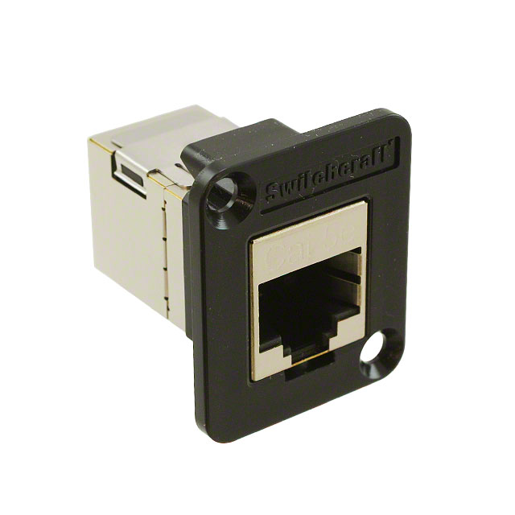
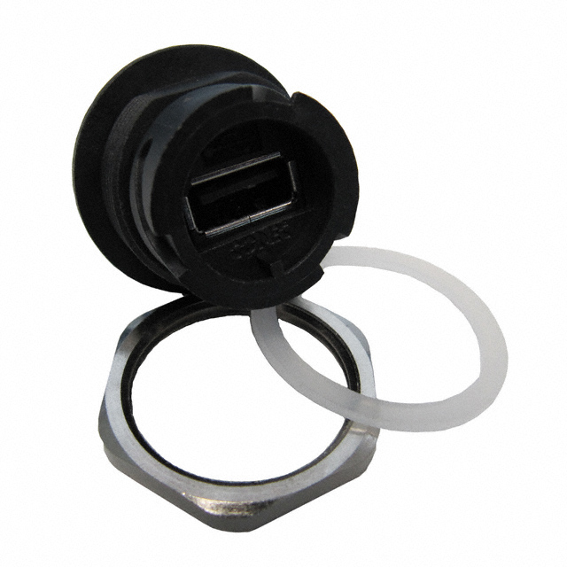
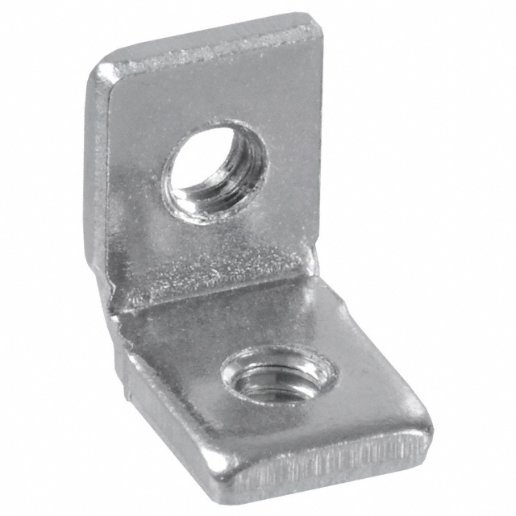
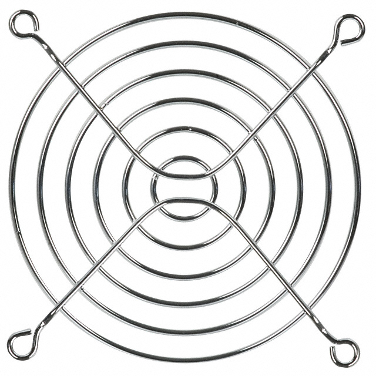
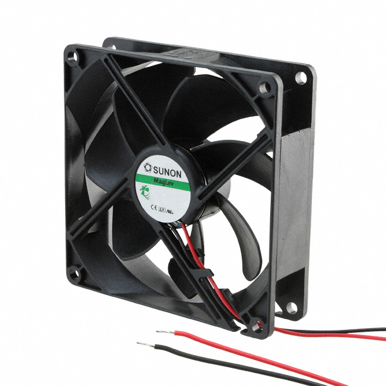
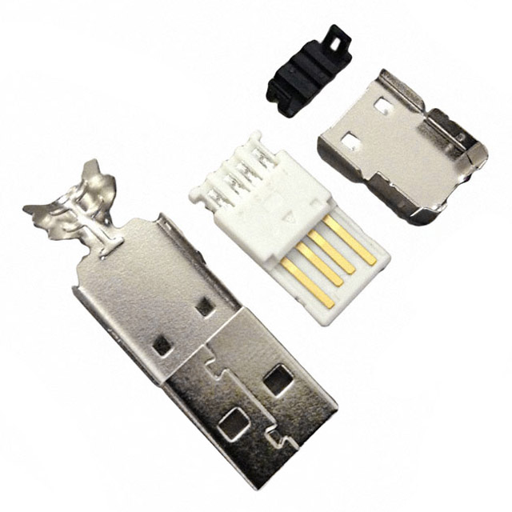
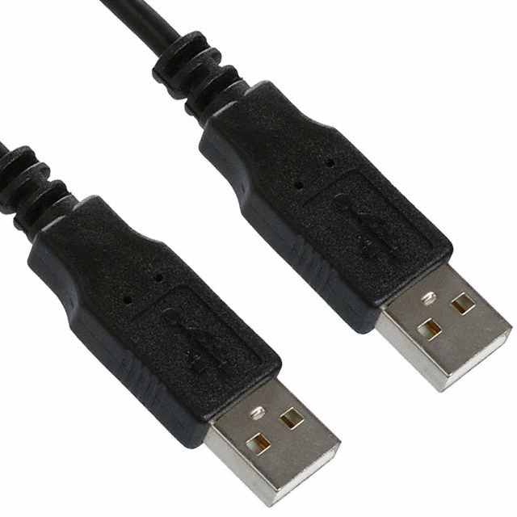

# Design files for enclosure, including DDS

## Files

1. `*.fpd`

    Front Panel Designer files.

2. `*.dxf`

    For the waterjet.

3. `*.svg` and `*.png`

    Drawing

4. `dimensions`

    Dimensions of the front/back, top/bottom panels and their offsets from
    the inner corner.

## Holes and Considerations

1. Front

    1. Ethernet and USB serial console input
    2. Board power
    3. SD card and switch. Leave enough space for fingers
    4. Front fan holes enough for two fans
    5. Backup 48V feed through hole
    6. Backup mount hole for the power converter board

2. Back

    1. Backup ethernet and USB serial console input
    2. Back fan holes enough for two fans

3. Top

    1. Mount holes for power splitters (8 ports x3, 3 ports x1) with different
    orientation and position options
    2. TTL/camera link with mount holes for the camera link adapter plate.
    3. CLock output
    4. REF CLK inputs and signal outputs for the DDS boards. Output holes
    should not make contact with the connectors
    5. Mount holes for the L-brackets for the DDS boards
    6. Auxiliary holes for powering the clock amplifier outside.
    7. Holes for LED / thermal monitor
    8. Auxiliary holes for WindFreak clock

4. Bottom

    1. Mount holes for the FPGA board and the breakout boards.

5. Left (DDS side)

    1. 48V feed through hole
    2. Mount hole for the power converter board, including the 12V to 5V
       converter module

## Drawing

1. Front

    

2. Back

    

3. Top

    

4. Bottom

    

## Parts

1. Ethernet feedthrough

    [EHRJ45P5ES](http://www.digikey.com/product-detail/en/EHRJ45P5ES/EHRJ45P5ES-ND/2666475)

    

2. USB feedthrough

    [17-200001](http://www.digikey.com/product-detail/en/17-200001/626-1352-ND/2184932)

    

3. L bracket

    [621](http://www.digikey.com/product-detail/en/621/621K-ND/316544)

    

4. Finger guard

    [08174](http://www.digikey.com/product-detail/en/08174/CR220-ND/43240)

    

5. Fan

    [HA92251V4-000U-999](http://www.digikey.com/product-detail/en/HA92251V4-000U-999/259-1614-ND/1937331)

    

6. USB-A Power connector

    [A-USBPA-R](http://www.digikey.com/product-detail/en/A-USBPA-R/AE10091-ND/1007894)

    

7. USB-A Male to USB-A Male cable

    [AK670/2-1-BLACK-R](http://www.digikey.com/product-detail/en/AK670%2F2-1-BLACK-R/AE10623-ND/2391702)
    

8. Power connector

    [KPJX-PM-4S](http://www.mouser.com/ProductDetail/Kycon/KPJX-PM-4S/?qs=sGAEpiMZZMtnOp%252bbbqA001IXQJRyqYiVKhxOyaJFs88%3d)
