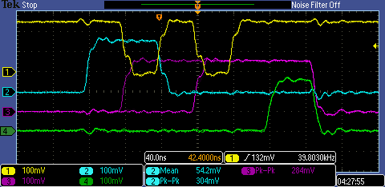
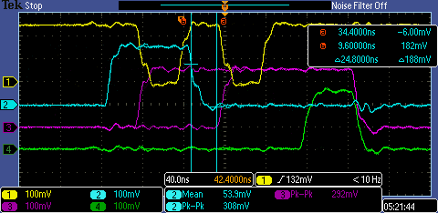

|Position easured                 |Value / V |
|---------------------------------|----------|
|DC-DC converter in, on board     |47.98     |
|3.3V out, closest point to converter out|3.610|
|3.3V out, furthest point to converter out on board|3.602|
|1.8V out, closest point to converter out|1.966|
|1.8V out, furthest point to converter out on board|1.957|
|Voltage drop for 1.8V line on board|0.004   |
|Voltage drop for 3.3V line on board|0.003   |
|Voltage drop for converter ground out on board|0.005|
|3.3V at the connector on the breakout board 1|3.464|
|3.3V at the connector on the breakout board 2|3.412|
|1.8V at the connector on the breakout board 1|1.832|
|1.8V at the connector on the breakout board 2|1.817|
|3.3V at the jumper on the breakout board 1|3.417|
|3.3V at the jumper on the breakout board 2|3.384|
|1.8V at the jumper on the breakout board 1|1.809|
|1.8V at the jumper on the breakout board 2|1.803|
|3.3V at the 8x2 connector on the DDS board 1|3.423 (expect [3.135, 3.465])|
|3.3V at the 8x2 connector on the DDS board 2|3.390 (expect [3.135, 3.465])|
|1.8V at X6 on the DDS board 1|1.800 (expect [1.71, 1.89])|
|1.8V at X6 on the DDS board 2|1.796 (expect [1.71, 1.89])|
|3.3V total voltage drop for board 1|0.187   |
|3.3V total voltage drop for board 2|0.226   |
|1.8V total voltage drop for board 1|0.166   |
|1.8V total voltage drop for board 2|0.169   |
|12V on board                     |11.96     |
|12V on breakout board 1          |11.84     |
|12V on breakout board 2          |11.86     |
|Output amp bias on breakout 1|4.446 (expect [4.3, 4.9])|
|Output amp bias on breakout 2|4.413 (expect [4.3, 4.9])|

|Voltages on DDS 9|Total failing rate|
|-----------------|------------------|
|3.075, 1.608     |0.00%             |
|3.107, 1.641     |1.21%             |
|3.195, 1.670     |43.51%            |

## 2014/12/23

### Before any change to the hardware

#### Test condition

`0x80` write with each step `0x10000` repeated `0x100` times on each channel.

#### Three write and one read!

Connection one thin wires for both breakout:
```
Total failing rate: 0.00%
```

Two thin wires for breakout 2, one thick wire for breakout 1:
```
Failing rate for DDS 3: 0.01+-0.01%
Failing rate for DDS 4: 0.00+-0.00%
Failing rate for DDS 5: 0.02+-0.01%
Failing rate for DDS 7: 6.66+-0.30%
Failing rate for DDS 8: 1.00+-0.07%
Total failing rate: 0.37%
```

Two thin wires for breakout 2, one thick wire for breakout 1 (10% trim up):
```
Failing rate for DDS 0: 99.22+-0.00%
Failing rate for DDS 1: 99.22+-0.00%
Failing rate for DDS 2: 99.22+-0.00%
Failing rate for DDS 3: 99.22+-0.00%
Failing rate for DDS 4: 99.22+-0.00%
Failing rate for DDS 5: 99.22+-0.00%
Failing rate for DDS 6: 99.22+-0.00%
Failing rate for DDS 7: 99.22+-0.00%
Failing rate for DDS 8: 99.22+-0.00%
Failing rate for DDS 9: 99.22+-0.00%
Failing rate for DDS 11: 60.87+-0.32%
Failing rate for DDS 12: 59.91+-0.32%
Failing rate for DDS 13: 99.69+-0.02%
Failing rate for DDS 14: 99.23+-0.01%
Failing rate for DDS 15: 99.22+-0.00%
Failing rate for DDS 16: 99.22+-0.00%
Failing rate for DDS 17: 99.74+-0.02%
Failing rate for DDS 18: 99.74+-0.02%
Failing rate for DDS 19: 99.65+-0.02%
Failing rate for DDS 20: 99.57+-0.02%
Failing rate for DDS 21: 87.57+-0.40%
Total failing rate: 95.08%
```

#### One write and one read.

Two thin wires for breakout 2, one thick wire for breakout 1:
```
Failing rate for DDS 0: 99.63+-0.02%
Failing rate for DDS 1: 99.59+-0.02%
Failing rate for DDS 2: 99.45+-0.02%
Failing rate for DDS 3: 99.35+-0.02%
Failing rate for DDS 4: 99.25+-0.01%
Failing rate for DDS 5: 99.22+-0.00%
Failing rate for DDS 6: 99.22+-0.00%
Failing rate for DDS 7: 99.22+-0.00%
Failing rate for DDS 8: 99.22+-0.00%
Failing rate for DDS 9: 99.28+-0.01%
Total failing rate: 47.31%
```

Note that DDS 8 and DDS 9 were never over voltaged.

Two thin wires for breakout 1, one thick wire for breakout 2:
```
Failing rate for DDS 0: 74.44+-0.28%
Failing rate for DDS 1: 94.26+-0.17%
Failing rate for DDS 2: 99.80+-0.02%
Failing rate for DDS 3: 99.56+-0.02%
Failing rate for DDS 4: 99.51+-0.02%
Failing rate for DDS 5: 99.41+-0.02%
Failing rate for DDS 6: 99.40+-0.02%
Failing rate for DDS 7: 99.39+-0.02%
Failing rate for DDS 8: 99.54+-0.02%
Failing rate for DDS 9: 99.60+-0.02%
Total failing rate: 45.95%
```

One thin wires for breakout 1, one thick wire for breakout 2:
```
Failing rate for DDS 7: 0.42+-0.09%
Failing rate for DDS 8: 0.05+-0.02%
Total failing rate: 0.02%
```

Swap No 9 and No 21

One thin wires for breakout 1, one thick wire for breakout 2:
```
Failing rate for DDS 4: 0.00+-0.00%
Failing rate for DDS 5: 0.13+-0.02%
Failing rate for DDS 6: 0.04+-0.01%
Failing rate for DDS 7: 5.76+-0.29%
Failing rate for DDS 8: 3.02+-0.21%
Failing rate for DDS 9: 14.44+-0.39%
Total failing rate: 1.11%
```
```
Failing rate for DDS 7: 0.42+-0.09%
Failing rate for DDS 8: 0.05+-0.02%
Total failing rate: 0.02%
```

Two thin wires for breakout 1, one thick wire for breakout 2:
With No 9 and No 21 swapped
```
Failing rate for DDS 0: 89.93+-0.36%
Failing rate for DDS 1: 97.75+-0.20%
Failing rate for DDS 2: 99.60+-0.02%
Failing rate for DDS 3: 99.48+-0.02%
Failing rate for DDS 4: 99.41+-0.02%
Failing rate for DDS 5: 99.29+-0.01%
Failing rate for DDS 6: 99.28+-0.01%
Failing rate for DDS 7: 99.28+-0.01%
Failing rate for DDS 8: 99.44+-0.02%
Failing rate for DDS 9: 99.43+-0.02%
Total failing rate: 46.80%
```

Unplug (new) No 21 (and the origianal No 21 is in the No 9 slot)
Two thin wires for breakout 1, one thick wire for breakout 2:
```
Missing DDS: 10
Missing DDS: 21
Failing rate for DDS 0: 85.08+-0.29%
Failing rate for DDS 1: 98.66+-0.11%
Failing rate for DDS 2: 99.61+-0.02%
Failing rate for DDS 3: 99.46+-0.02%
Failing rate for DDS 4: 99.38+-0.02%
Failing rate for DDS 5: 99.26+-0.01%
Failing rate for DDS 6: 99.24+-0.01%
Failing rate for DDS 7: 99.26+-0.01%
Failing rate for DDS 8: 99.35+-0.02%
Failing rate for DDS 9: 99.33+-0.02%
Total failing rate: 48.93%
```

#### Scope trace of digital signals
Breakout Board 1


Breakout Board 2



(Ground taken from Pin 51 on the 30x2 connector)

|Scope Channel No|Pin name|Pin No|
|----------------|--------|------|
|1               |WRB-IN  |56    |
|2               |A1      |49    |
|3               |D0      |42    |
|4               |FUD-IN  |53    |

The traces looks identical with different supply voltages to the board and with spec voltage supply, I can reliably reproduce > 99% failure rate.

### After making the address pulse longer
#### Scope trace of digital signals
Breakout Board 1



Breakout Board 2


#### Voltages On DDS boards

DC-DC converter trimmed up 10%.

* Board 1:

    powered with two thin cables.

* Board 2:

    powered with one thick cable.

|Net Name|Board 1 / V|Board 2 / V|
|--------|-----------|-----------|
|DVDD33  |3.353      |3.400      |
|DVDD18  |1.777      |1.745      |

#### Test condition

1. `0x80` write with each step `0x10000` repeated `0x800` times on each channel.

    No failure at any voltages.

2. `0x800` write with each step `0x80000` repeated `0x100` times on each channel.

    No failure at maximum voltage.
