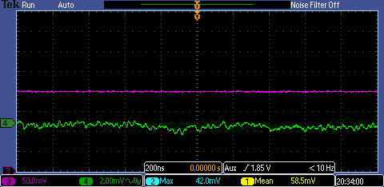
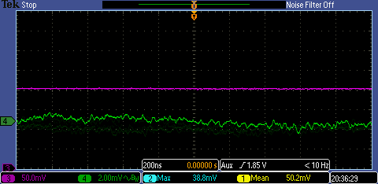
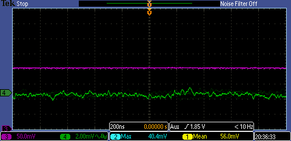
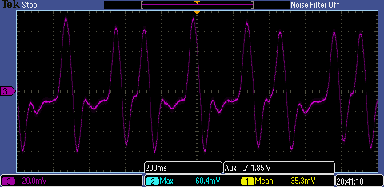

# Scope traces

Channel 3 (DC) and Channel 4 (AC) are the same signal.

* Current when T2 is railed

    

    

* Current when T2 is railed and when the fast feedback is disconnected

    

    

* delta T2 when the laser is on and the temperature starts oscillate.

    * With fast feedback plugged in

        

    * With fast feedback unplugged

        
