* Total price: `$26044.72`

1. FPGA dev board from **[AVNET](http://avnetexpress.avnet.com/)**

    Total price: `$895.00`

    [Avnet Listing](http://avnetexpress.avnet.com/store/em/EMController/_/A-5004312321719?action=part&catalogId=500201&langId=-1&storeId=500201)

    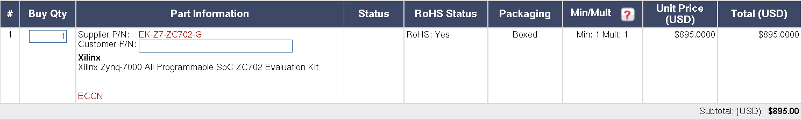

2. Box from **[Lansing Enclosure](http://www.lansing-enclosures.com/)**

    Total price: `$149.00`

    [Lansing Enclosures Price List](http://www.lansing-enclosures.com/main/media/graybox_prices.pdf)

    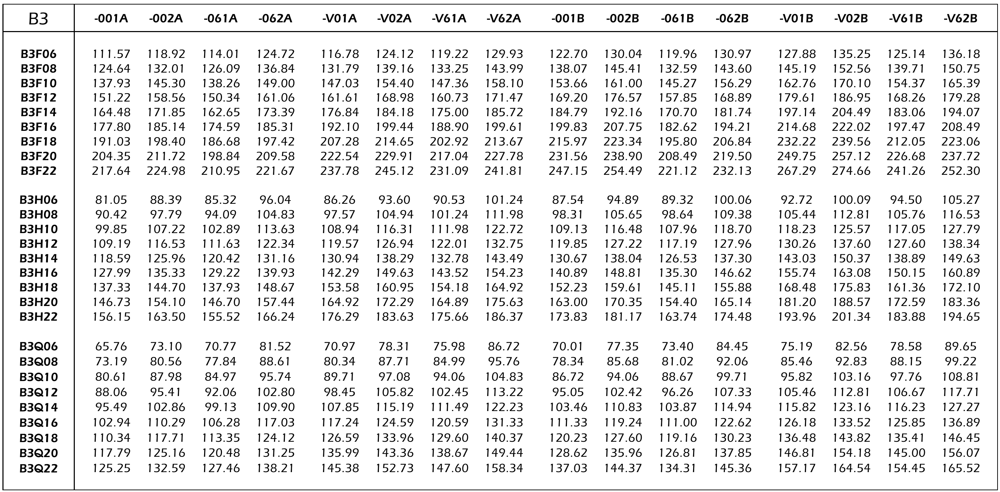

3. Auxiliary parts from **[DigiKey](http://www.digikey.com/)**

    Total price: `$261.82`

    [Detailed listing](aux-digikey.md)

    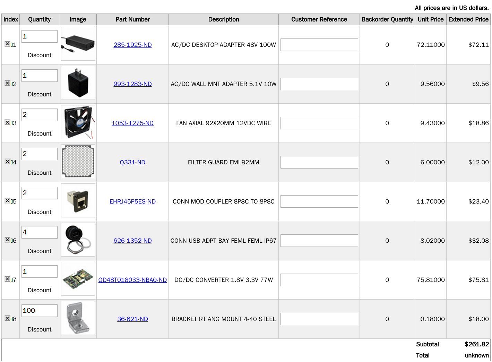

5. MixNV from **[Windfreak](https://www.windfreaktech.com/)**

    Total price: `$499.00`

    [Windfreak listing](https://www.windfreaktech.com/rf-mixer-downconverter-upconverter.html)

    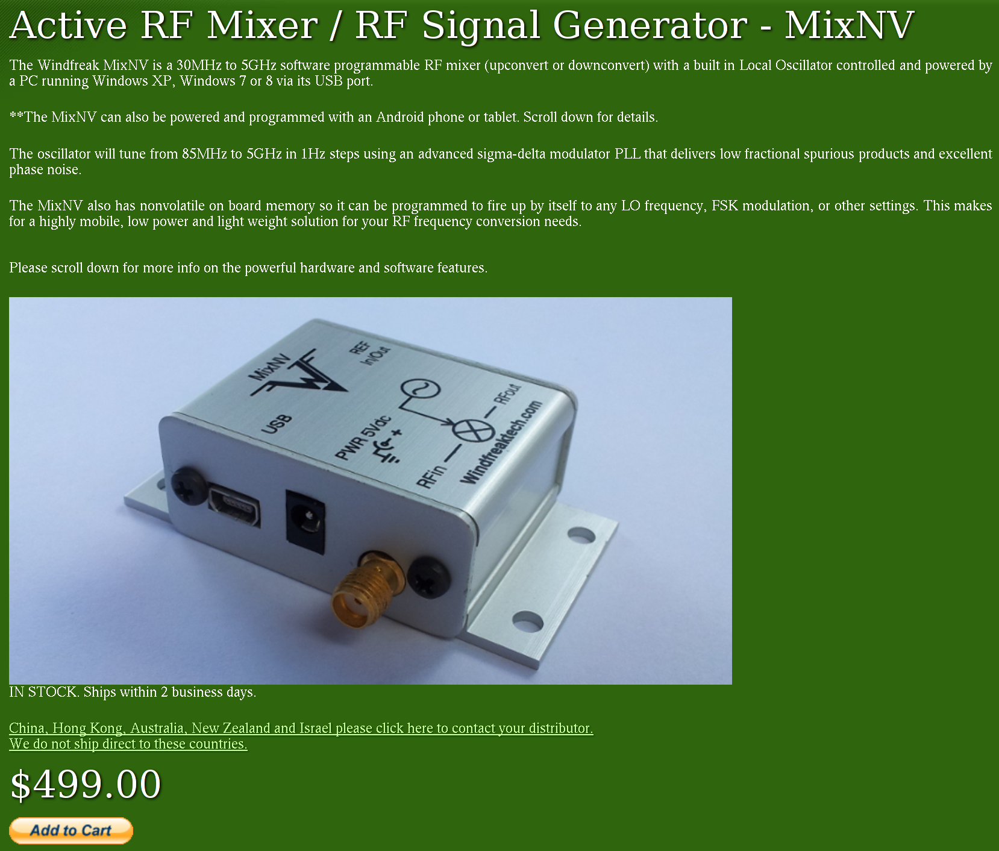

6. Auxiliary parts from **[L-com](http://www.l-com.com/)**

    Total price: `$474.27`

    [Detailed listing](aux-lcom.md)

    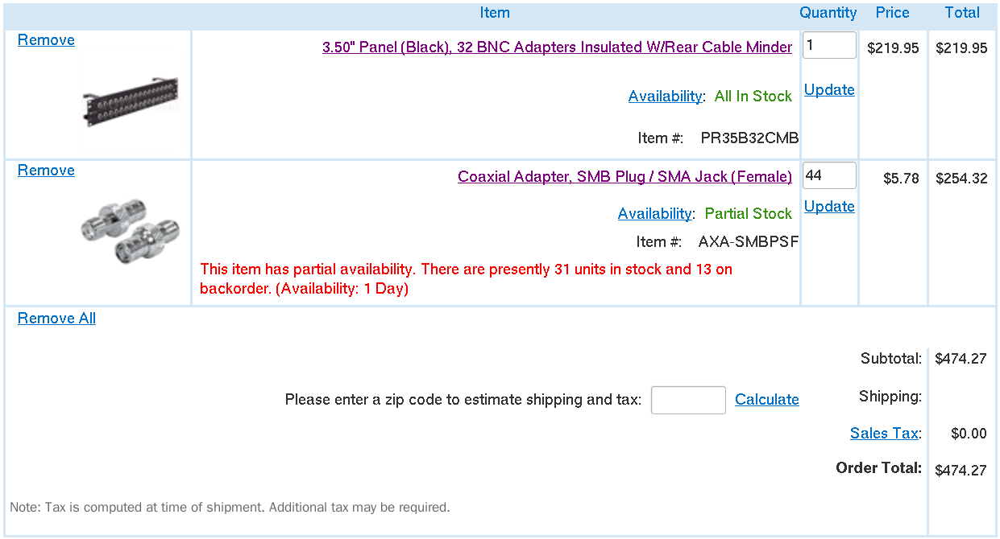

7. Analog output cards from **[National Instruments](http://www.ni.com/)**

    Total price: `$2116.80`

    [Quote](ni.pdf)

    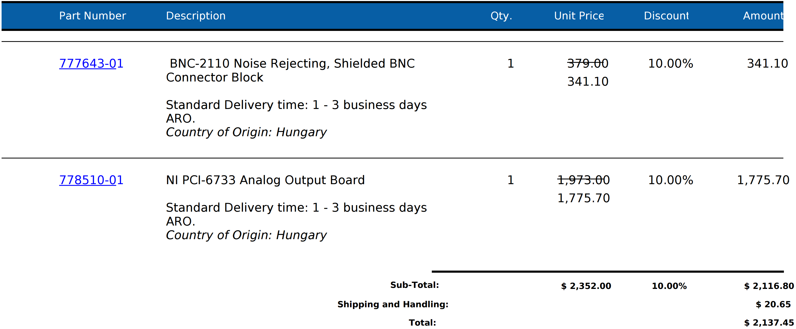

8. Parts from **[Minicircuits](http://www.minicircuits.com/homepage/homepage.html)**

    Total price: `$728.25`

    [Detailed listing](minicircuits.md)

    

9. Camera link-computer interface from **[National Instruments](http://www.ni.com/)**

    Total price: `$10788.00`

    [Online listing](http://sine.ni.com/nips/cds/view/p/lang/en/nid/210236)

    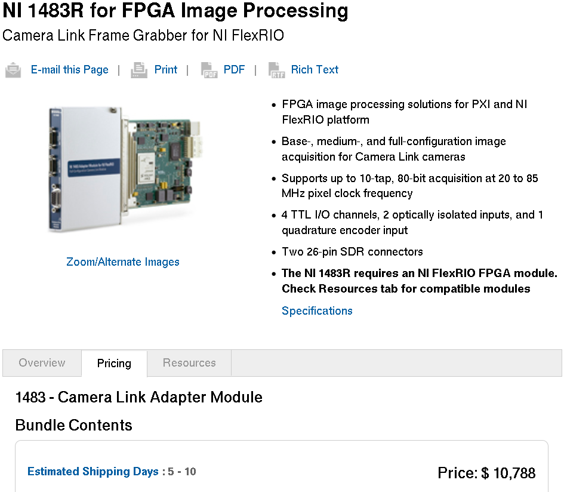

10. PCB's

    1. Camera link-FPGA interface

        Total price: `$427.05`

        * Parts from **[DigiKey](http://www.digikey.com/)**

            Subtotal: `$172.05`

            [Detailed listing](cmrlink-digikey.md)

            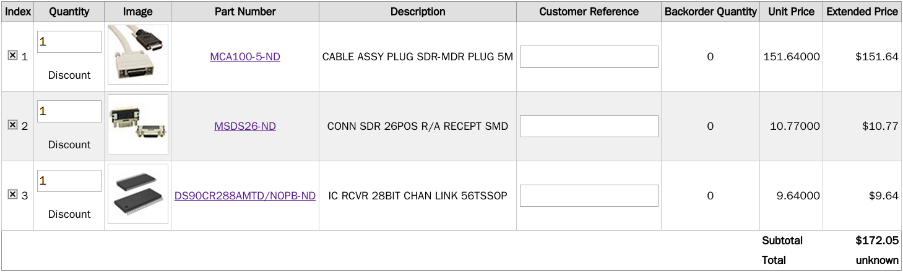

        * PCB from **[Sunstone](http://www.sunstone.com/)**

            Subtotal: `$255.00`

            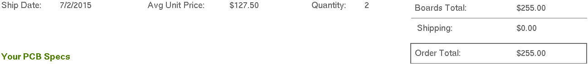

    2. Power breakout board

        Total price: `$66.00`

        * PCB from **[Advanced circuits](http://www.4pcb.com/)**

            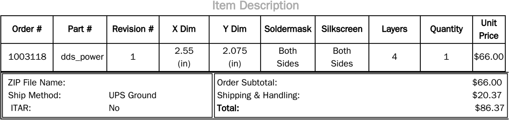

    3. DDS board

        Total price: `$7867.73`

        * Parts from **[DigiKey](http://www.digikey.com/)**

            Subtotal: `$5490.53`

            [Detailed listing](dds-digikey.md)

            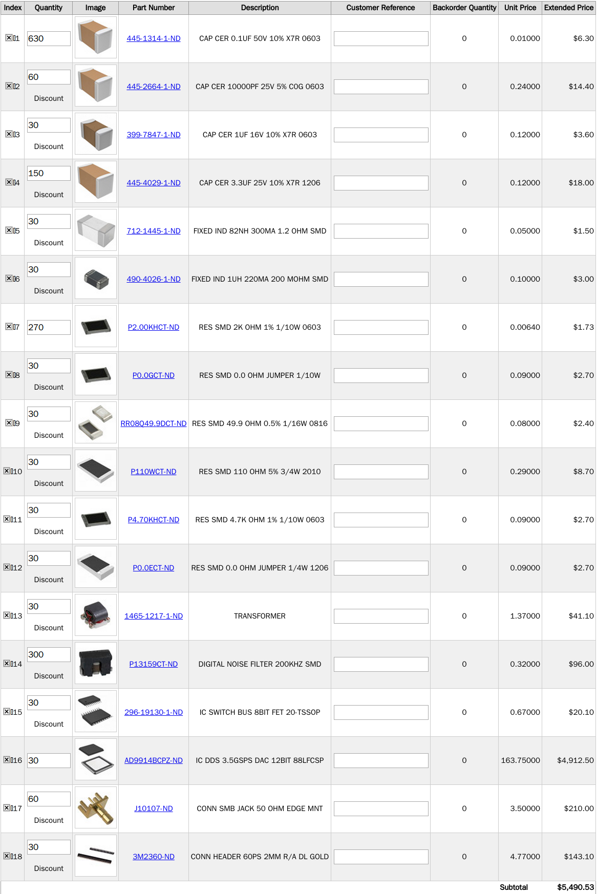

        * PCB & Assembly by **[Screaming Circuits](https://www.screamingcircuits.com/)**

            Subtotal: `$2377.20`

            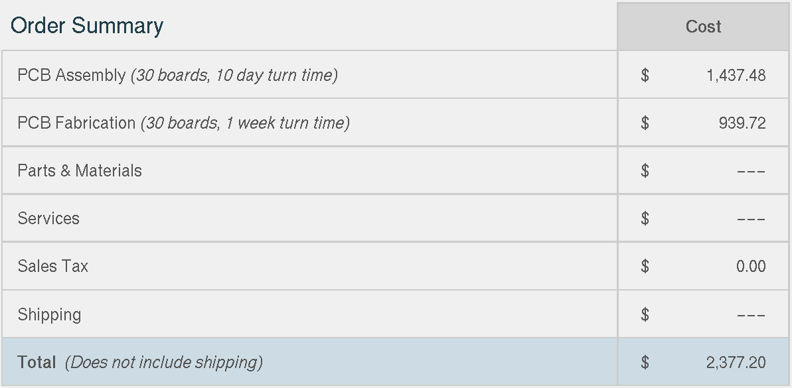

    4. FPGA breakout board

        Total price: `$1128.80`

        * Parts from **[DigiKey](http://www.digikey.com/)**

            Subtotal: `$46.74`

            [Detailed listing](fpga_breakout-digikey.md)

            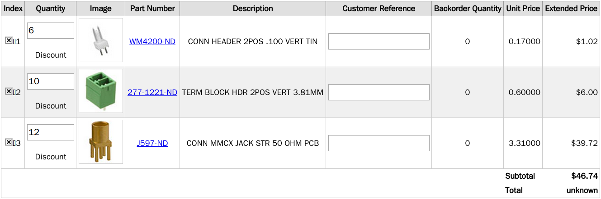

        * PCB & Assembly

            Subtotal: `$1082.06`

            PCB from **[Sunstone](http://www.sunstone.com/)**

            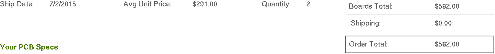

            Assembly by **[Screaming Circuits](https://www.screamingcircuits.com/)**

            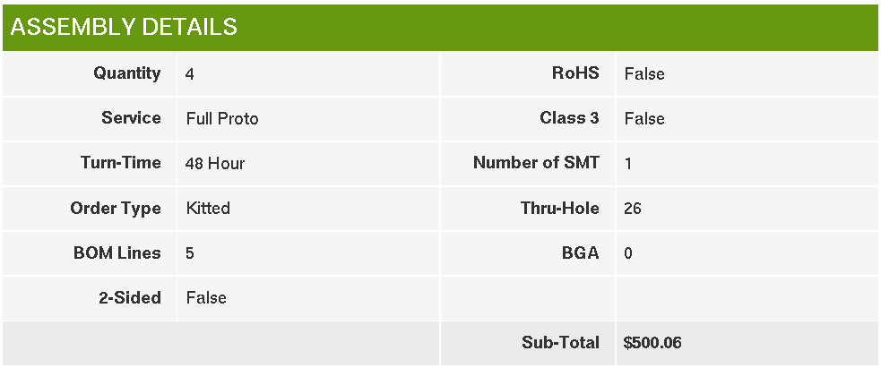

    5. TTL board

        Total price: `$643.00`

        * PCB from **[Sunstone](http://www.sunstone.com/)**

            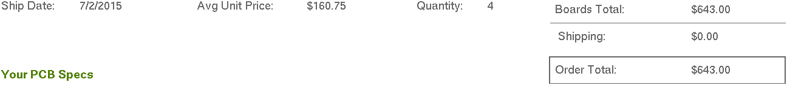
