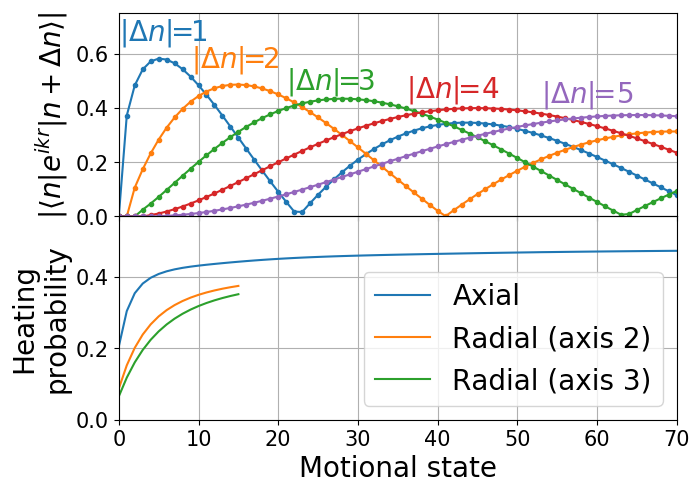
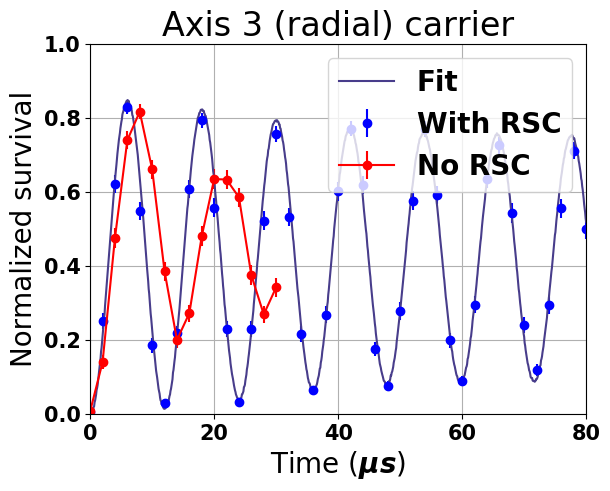
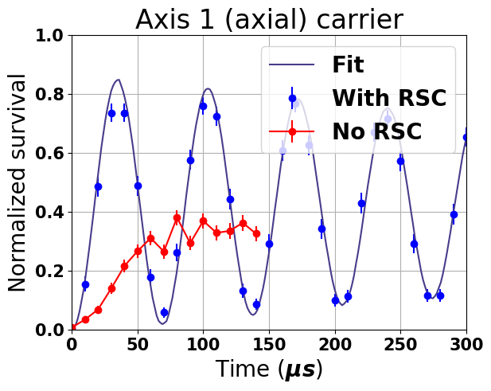
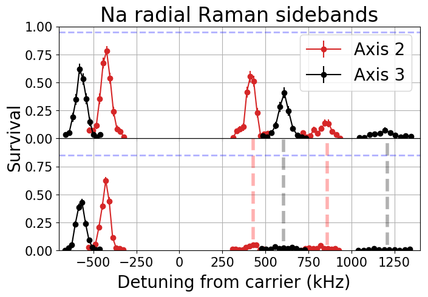
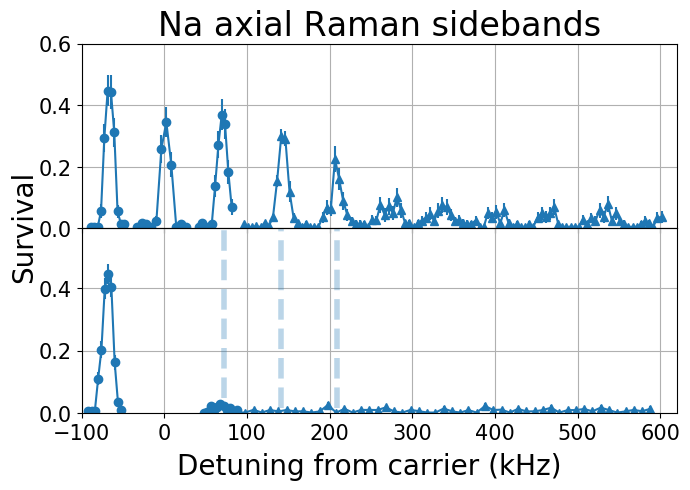

# Challenges and solutions

## Challenges
* High initial temperature (40μK)
* Large Lamb-Dicked parameters {0.60, 0.24, 0.21}
* High optical pumping heating
* Complex sideband structure
* Trap anharmonicity
* Trap AC Stark shift

## Solutions
* Cooling with high order sideband
* Optimize cooling with simulation
* Fast cooling pulse
* Trap switching

# Results

Ground state ratio:
* Axis 1 (Axial): 91.6(28)%
* Axis 2 (Radial): 89.7(19)%
* Axis 3 (Radial): 93.8(26)%
* Combined: 77.1(35)%
